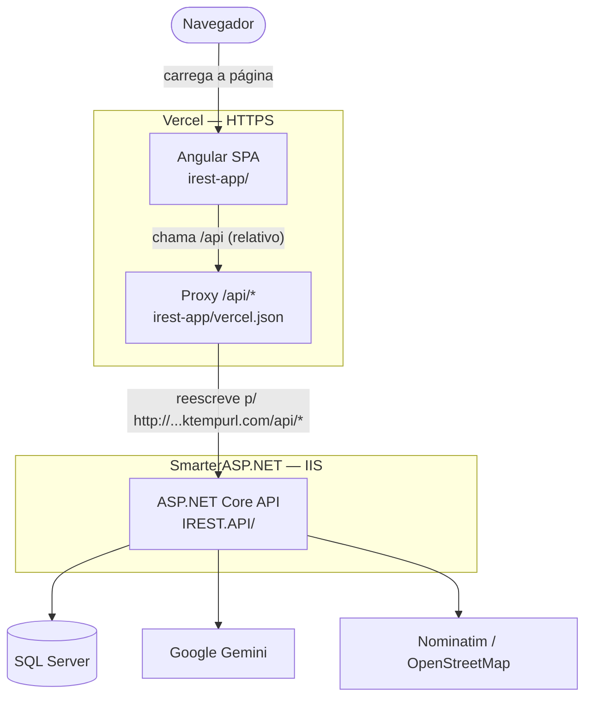
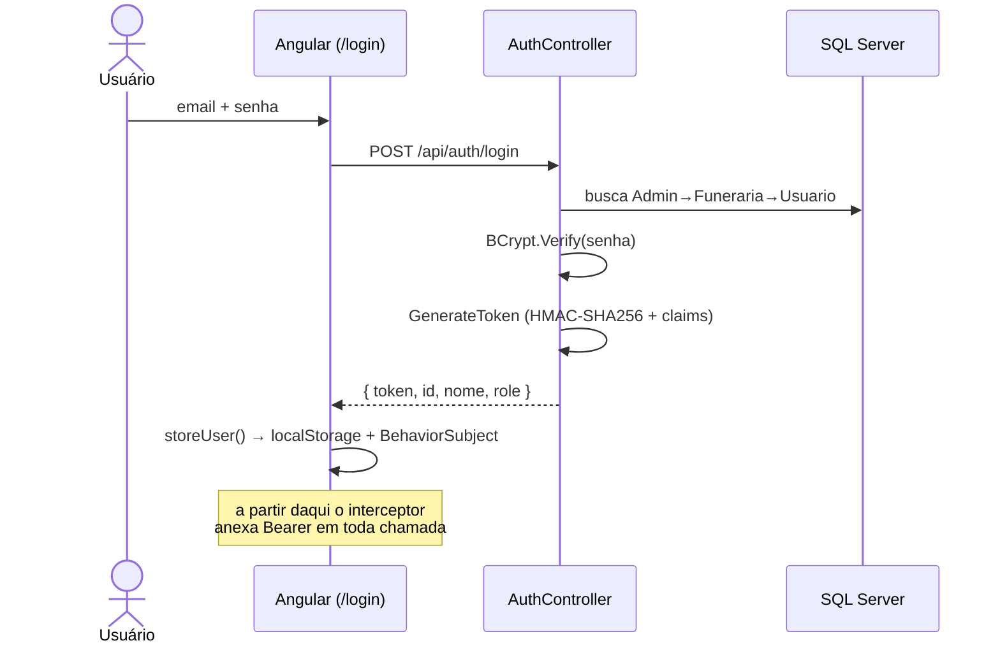
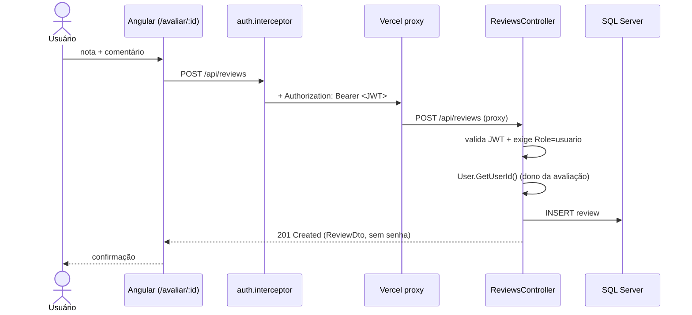
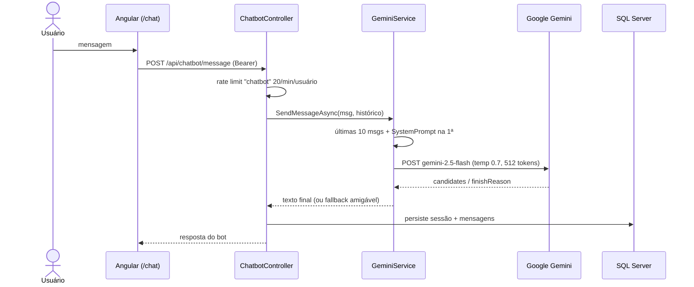

# Arquitetura do IREST

Documento de referência: **o que** e **como** cada camada faz, com o arquivo (e linha)
onde a funcionalidade está implementada.

- **Frontend:** Angular 21 (SPA) — hospedado no **Vercel**
- **Backend:** ASP.NET Core 8 (Web API) — hospedado no **SmarterASP.NET**
- **Banco:** SQL Server (`sql1002.site4now.net`) via EF Core
- **Papéis:** `usuario`, `funeraria`, `admin`

**Regra de ouro da divisão:** o **frontend** cuida da experiência e *esconde/mostra* telas por
papel (controle cosmético); o **backend** é a **fonte da verdade** — valida o token e *realmente*
autoriza cada operação. As duas camadas verificam papel, mas só a do backend tem valor de segurança.

---

## 1. Visão de deploy

**Como o proxy funciona:** o Angular chama `/api` (caminho relativo). O `vercel.json` reescreve
`/api/*` para o backend HTTP no servidor da Vercel — assim o navegador só fala HTTPS com a Vercel
e nunca chama o backend HTTP direto (evita *mixed content*).

| Peça | Arquivo |
|---|---|
| Proxy + fallback SPA | [irest-app/vercel.json](../irest-app/vercel.json) |
| URL da API (prod = `/api`) | [environment.prod.ts](../irest-app/src/environments/environment.prod.ts) |
| URL da API (dev = `localhost:5019`) | [environment.ts](../irest-app/src/environments/environment.ts) |
| Config IIS do backend | `IREST.API/IREST.API/publish/web.config` |

---

## 2. FRONTEND

### 2.1 O que é responsabilidade do frontend

- Renderizar todas as telas e a navegação (SPA, sem recarregar a página).
- Filtrar/buscar funerárias **no cliente** (a home recebe a lista e filtra em memória).
- Guardar a sessão (JWT) e anexá-la a cada requisição.
- Mostrar/esconder telas e itens de menu conforme o papel logado.
- Validar formulários antes de enviar e exibir erros/respostas da API.
- **Não** decide permissões de verdade nem guarda dados — isso é do backend.

### 2.2 Como funciona (mecanismos)

**a) Login e sessão** — [services/auth.service.ts](../irest-app/src/app/services/auth.service.ts)
- `login()` faz `POST /Auth/login` e, no `tap`, chama `storeUser()` ([auth.service.ts:88](../irest-app/src/app/services/auth.service.ts#L88)).
- `storeUser()` grava `authToken` e `currentUser` no **localStorage** e emite num
  `BehaviorSubject` (`currentUser$`) — a UI reage em tempo real ([auth.service.ts:54](../irest-app/src/app/services/auth.service.ts#L54)).
- O papel vem no objeto retornado pela API; getters `isAdmin/isFuneraria/isUsuario` leem
  `currentUser.role` ([auth.service.ts:68](../irest-app/src/app/services/auth.service.ts#L68)).
- `logout()` apenas remove as chaves do localStorage e zera o subject.

**b) Envio do token** — [core/interceptors/auth.interceptor.ts](../irest-app/src/app/core/interceptors/auth.interceptor.ts)
- Intercepta **toda** requisição HTTP, lê `authToken` do localStorage e, se existir, clona a
  requisição adicionando `Authorization: Bearer <token>` ([auth.interceptor.ts:24](../irest-app/src/app/core/interceptors/auth.interceptor.ts#L24)).

**c) Proteção de rotas** — [core/guards/auth.guard.ts](../irest-app/src/app/core/guards/auth.guard.ts)
- São `CanActivateFn`: `authGuard` (logado), `adminGuard`, `funerariaGuard`, `usuarioGuard`.
- Cada guard checa o getter correspondente do `AuthService` e, se falhar, faz
  `router.navigate(['/login'])` e retorna `false`.
- ⚠️ É um **portão cosmético**: protege a *navegação*, não os dados. Quem forjar o estado ainda
  esbarra na autorização do backend.

**d) Filtro da home** — [features/home/home.ts](../irest-app/src/app/features/home/home.ts)
- `loadFunerarias()` busca a lista completa; `aplicarFiltros()` aplica uma cadeia de `.filter()`
  em memória (cidade, tipo de serviço, texto nome/bairro, preço mín/máx) e calcula nota média e
  "a partir de" ([home.ts:79](../irest-app/src/app/features/home/home.ts#L79)).

**e) Acesso à API** — [services/](../irest-app/src/app/services/)
- Cada service é um *wrapper* fino sobre `HttpClient`, apontando para `environment.apiUrl`.
  Ex.: `funeraria.service.ts` → `/api/funerarias`.

### 2.3 Rotas → componente → arquivo

Mapa central de rotas: [app.routes.ts](../irest-app/src/app/app.routes.ts)

| Rota | Função | Arquivo |
|---|---|---|
| `/` | Home: lista + filtros | [home.ts](../irest-app/src/app/features/home/home.ts) |
| `/busca` | Resultados de busca | [search-results.ts](../irest-app/src/app/features/search-results/search-results.ts) |
| `/detalhes/:id` | Ficha + **mapa Leaflet** + serviços + avaliações | [funeral-home-details.ts](../irest-app/src/app/features/funeral-home-details/funeral-home-details.ts) |
| `/como-funciona` | Página informativa | [how-it-works.ts](../irest-app/src/app/features/how-it-works/how-it-works.ts) |
| `/ajuda` | FAQ / ajuda | [help.ts](../irest-app/src/app/features/help/help.ts) |
| `/login` | Login | [login.ts](../irest-app/src/app/features/login/login.ts) |
| `/cadastro` | Cadastro de usuário | [register.ts](../irest-app/src/app/features/register/register.ts) |
| `/cadastro-funeraria` | Cadastro de funerária | [register-funeraria.ts](../irest-app/src/app/features/register-funeraria/register-funeraria.ts) |
| `/esqueci-senha` | Recuperação de senha (pergunta de segurança) | [forgot-password.ts](../irest-app/src/app/features/forgot-password/forgot-password.ts) |
| `/avaliar/:id` | Formulário de avaliação (`usuario`) | [review-form.ts](../irest-app/src/app/features/review-form/review-form.ts) |
| `/chat` | Chatbot de IA (logado) | [help-chat.ts](../irest-app/src/app/features/help-chat/help-chat.ts) |
| `/meu-painel` | Painel do usuário (`usuario`) | [dashboard-user.ts](../irest-app/src/app/features/dashboard-user/dashboard-user.ts) |
| `/painel-funeraria` | Painel da funerária (`funeraria`) | [dashboard-provider.ts](../irest-app/src/app/features/dashboard-provider/dashboard-provider.ts) |
| `/painel-admin` | Painel admin + CRUD geral (`admin`) | [dashboard-admin.ts](../irest-app/src/app/features/dashboard-admin/dashboard-admin.ts) · [admin-crud.component.ts](../irest-app/src/app/features/admin-crud/admin-crud.component.ts) |

### 2.4 Componentes compartilhados e segurança

| Item | Função | Arquivo |
|---|---|---|
| Header | Menu que muda por papel | [core/components/header/header.ts](../irest-app/src/app/core/components/header/header.ts) |
| Lista de funerárias | Card reutilizável | [funeraria-list.component.ts](../irest-app/src/app/components/funeraria-list/funeraria-list.component.ts) |
| Criar avaliação | Form embutível | [review-create.component.ts](../irest-app/src/app/components/review-create/review-create.component.ts) |
| Sessão de chat | UI da conversa | [chat-session.component.ts](../irest-app/src/app/components/chat-session/chat-session.component.ts) |
| Guarda do JWT + papéis | `AuthService` | [auth.service.ts](../irest-app/src/app/services/auth.service.ts) |
| Guards de rota | `auth.guard.ts` | [auth.guard.ts](../irest-app/src/app/core/guards/auth.guard.ts) |
| Bearer token | `auth.interceptor.ts` | [auth.interceptor.ts](../irest-app/src/app/core/interceptors/auth.interceptor.ts) |

---

## 3. BACKEND

### 3.1 O que é responsabilidade do backend

- Autenticar (emitir JWT) e **autorizar** cada operação por papel.
- Aplicar as regras de negócio e persistir tudo no SQL Server (EF Core).
- Proteger segredos: nunca devolver senha; hash com BCrypt.
- Integrações externas: chatbot (Gemini), geocoding (Nominatim), e-mail (MailKit).
- Defesas: CORS restrito, rate limiting, security headers, HTTPS/HSTS, validação de config.

### 3.2 Como funciona (mecanismos)

**a) Geração do JWT** — [AuthController.GenerateToken](../IREST.API/IREST.API/Controllers/AuthController.cs#L261)
- Assina com **HMAC-SHA256** usando `Jwt:Key`. Claims: `NameIdentifier`(id), `Name`, `Email`,
  `Role`. `issuer`, `audience` e `ExpireMinutes` vêm do config ([AuthController.cs:261](../IREST.API/IREST.API/Controllers/AuthController.cs#L261)).

**b) Login unificado** — [AuthController.Login](../IREST.API/IREST.API/Controllers/AuthController.cs#L127)
- Procura o e-mail em ordem **Admins → Funerarias → Usuarios** e confere a senha com
  `BCrypt.Verify`. O primeiro que casar define o papel do token. Falhou em todos → `401`.

**c) Senhas** — register/reset
- Sempre `BCrypt.HashPassword` ao gravar ([AuthController.cs:51](../IREST.API/IREST.API/Controllers/AuthController.cs#L51)). O banco nunca guarda senha em texto puro.

**d) Reset de senha = pergunta de segurança** (não é token por e-mail!)
- `forgot-password` devolve a **pergunta** de segurança do e-mail ([AuthController.cs:190](../IREST.API/IREST.API/Controllers/AuthController.cs#L190)).
- `reset-password` compara a **resposta** (com `Trim().ToLower()`) e, se bater, grava o novo hash
  BCrypt ([AuthController.cs:212](../IREST.API/IREST.API/Controllers/AuthController.cs#L212)).
- *Obs.:* existem `EmailService.cs` e o model `PasswordResetToken.cs` no projeto, mas **não** são
  usados por esse fluxo atual (ficaram de uma abordagem anterior por e-mail).

**e) Validação do JWT** — [Program.cs:61](../IREST.API/IREST.API/Program.cs#L61)
- `AddJwtBearer` valida issuer, audience, **lifetime**, assinatura e usa `ClockSkew` de 1 min.
  Em produção exige metadata HTTPS.

**f) Autorização por papel** — atributos nos controllers
- `[Authorize(Roles = "admin")]`, `"funeraria"`, `"usuario,admin"` etc. O ASP.NET barra antes de
  entrar no método. Ex.: escrever funerária é só admin ([FunerariasController.cs:63](../IREST.API/IREST.API/Controllers/FunerariasController.cs#L63)).

**g) Identificar o usuário do token** — [ClaimsPrincipalExtensions.cs](../IREST.API/IREST.API/Extensions/ClaimsPrincipalExtensions.cs)
- `User.GetUserId()` lê o claim `NameIdentifier`; `GetRole()` lê o papel. É assim que o backend
  sabe "de quem" é a operação (ex.: a funerária só edita os próprios serviços).

**h) DTOs protegem a senha** — [MappingExtensions.cs](../IREST.API/IREST.API/Extensions/MappingExtensions.cs)
- `.ToDto()` copia só campos públicos (id, nome, email, relações) — o campo `Senha` **nunca** sai
  da API porque não existe no DTO.

**i) Geocoding** — [GeocodingService.cs](../IREST.API/IREST.API/Services/GeocodingService.cs)
- Monta `endereco, cidade, estado`, chama o **Nominatim/OpenStreetMap** (`countrycodes=br`,
  `limit=1`) e converte lat/lon (`InvariantCulture`). Chamado ao cadastrar/editar funerária; o
  resultado alimenta o mapa Leaflet do frontend. Em erro, retorna `null` (não quebra o cadastro).

**j) Chatbot Gemini** — [GeminiService.cs](../IREST.API/IREST.API/Services/GeminiService.cs)
- Pega as **últimas 10** mensagens do histórico, injeta o `SystemPrompt` (assistente empático,
  só fala de IREST/luto) na **primeira** mensagem do usuário, e faz `POST` ao modelo
  `gemini-2.5-flash` (`temperature=0.7`, `maxOutputTokens=512`, timeout 15s).
- Trata `finishReason` (SAFETY/RECITATION), ignora partes "thought" e concatena o texto final.
  Sem chave configurada ou em erro, devolve mensagem amigável em vez de estourar.

**k) Rate limiting** — [Program.cs:83](../IREST.API/IREST.API/Program.cs#L83)
- Global **100 req/min por IP**; política `auth` **5/min por IP** (anti brute-force);
  política `chatbot` **20/min por usuário** (controla custo do Gemini). Excedeu → `429`.

**l) Defesa em profundidade** — [Program.cs](../IREST.API/IREST.API/Program.cs)
- **CORS** restrito à lista `AllowedCorsOrigins` ([:41](../IREST.API/IREST.API/Program.cs#L41));
  **security headers** (`X-Content-Type-Options`, `X-Frame-Options: DENY`, etc.) ([:203](../IREST.API/IREST.API/Program.cs#L203));
  `UseHttpsRedirection` + HSTS; forwarded headers para HTTPS atrás de proxy.

**m) Validação de config (fail-fast)** — [Program.cs:18](../IREST.API/IREST.API/Program.cs#L18)
- Se `Jwt:Key` faltar/ter < 32 chars ou a connection string faltar, a aplicação **nem sobe** —
  erro explícito em vez de comportamento inseguro.

**n) Seed de admin** — [Program.cs:156](../IREST.API/IREST.API/Program.cs#L156)
- No boot, se `AdminSeed:Email`/`Password` existirem e não houver admin com aquele e-mail, cria o
  admin com senha BCrypt. Senha < 8 chars → ignora e loga aviso.

### 3.3 Controllers → endpoints → quem pode → arquivo

Pasta: [Controllers/](../IREST.API/IREST.API/Controllers/)

| Controller | Endpoints | Quem pode | Arquivo |
|---|---|---|---|
| Auth | register, register-funeraria, login, forgot/reset-password | público | [AuthController.cs](../IREST.API/IREST.API/Controllers/AuthController.cs) |
| Funerárias | GET / POST / PUT / DELETE | GET público / escrita **admin** | [FunerariasController.cs](../IREST.API/IREST.API/Controllers/FunerariasController.cs) |
| Minha Funerária | perfil + serviços + reviews próprios | **funeraria** | [MinhaFunerariaController.cs](../IREST.API/IREST.API/Controllers/MinhaFunerariaController.cs) |
| Serviços | CRUD | GET público / escrita **admin, funeraria** | [ServicosController.cs](../IREST.API/IREST.API/Controllers/ServicosController.cs) |
| Avaliações | GET / POST / PUT / DELETE | criar **usuario** / excluir **admin, usuario** | [ReviewsController.cs](../IREST.API/IREST.API/Controllers/ReviewsController.cs) |
| Favoritos | CRUD | **usuario, admin** | [FavoritosController.cs](../IREST.API/IREST.API/Controllers/FavoritosController.cs) |
| Usuários | listar/criar/editar/excluir | **admin** (+ próprio) | [UsuariosController.cs](../IREST.API/IREST.API/Controllers/UsuariosController.cs) |
| Admins | CRUD | **admin** | [AdminsController.cs](../IREST.API/IREST.API/Controllers/AdminsController.cs) |
| Chatbot | POST message (IA) | logado | [ChatbotController.cs](../IREST.API/IREST.API/Controllers/ChatbotController.cs) |
| Sessões/Mensagens de chat | histórico | logado / escrita **admin** | [ChatbotSessionsController.cs](../IREST.API/IREST.API/Controllers/ChatbotSessionsController.cs) · [ChatbotMessagesController.cs](../IREST.API/IREST.API/Controllers/ChatbotMessagesController.cs) |

### 3.4 Services, models e pipeline

| Camada | Função | Arquivo |
|---|---|---|
| GeminiService | Chatbot IA (`gemini-2.5-flash`) | [Services/GeminiService.cs](../IREST.API/IREST.API/Services/GeminiService.cs) |
| GeocodingService | Endereço → lat/lng (Nominatim) | [Services/GeocodingService.cs](../IREST.API/IREST.API/Services/GeocodingService.cs) |
| EmailService | SMTP/MailKit *(presente, não usado no reset atual)* | [Services/EmailService.cs](../IREST.API/IREST.API/Services/EmailService.cs) |
| DbContext | EF Core / mapeamento das tabelas | [Data/AppDbContext.cs](../IREST.API/IREST.API/Data/AppDbContext.cs) |
| Mapeamento DTO | Esconde senha, monta payload público | [Extensions/MappingExtensions.cs](../IREST.API/IREST.API/Extensions/MappingExtensions.cs) |
| Claims do token | `GetUserId()` / `GetRole()` | [Extensions/ClaimsPrincipalExtensions.cs](../IREST.API/IREST.API/Extensions/ClaimsPrincipalExtensions.cs) |
| Pipeline (auth, CORS, rate limit, seed) | Bootstrap | [Program.cs](../IREST.API/IREST.API/Program.cs) |

Models: `Usuario`, `Funeraria`, `Serrvico` *(nome do arquivo com "rr")*, `Review`, `Favorito`,
`Admin`, `ChatbotSession`, `ChatbotMessage`, `PasswordResetToken` — em [Models/](../IREST.API/IREST.API/Models/).

---

## 4. Fluxos ponta a ponta

### 4.1 Login (como o JWT nasce e passa a ser usado)

### 4.2 Criar avaliação (autorização por papel na prática)

**Arquivos:** [review-form.ts](../irest-app/src/app/features/review-form/review-form.ts) ·
[review.service.ts](../irest-app/src/app/services/review.service.ts) ·
[auth.interceptor.ts](../irest-app/src/app/core/interceptors/auth.interceptor.ts) ·
[vercel.json](../irest-app/vercel.json) ·
[ReviewsController.cs](../IREST.API/IREST.API/Controllers/ReviewsController.cs) ·
[MappingExtensions.cs](../IREST.API/IREST.API/Extensions/MappingExtensions.cs)

### 4.3 Chatbot (como a IA é orquestrada)

**Arquivos:** [help-chat.ts](../irest-app/src/app/features/help-chat/help-chat.ts) ·
[chatbot.service.ts](../irest-app/src/app/services/chatbot.service.ts) ·
[ChatbotController.cs](../IREST.API/IREST.API/Controllers/ChatbotController.cs) ·
[GeminiService.cs](../IREST.API/IREST.API/Services/GeminiService.cs)

---

## 5. Matriz de autorização (reforçada no backend)

| Recurso | Público | usuario | funeraria | admin |
|---|:---:|:---:|:---:|:---:|
| Listar/ver funerárias | ✅ | ✅ | ✅ | ✅ |
| Criar/editar/excluir funerária | — | — | — | ✅ |
| Editar **própria** funerária + serviços | — | — | ✅ | — |
| Criar avaliação | — | ✅ | — | — |
| Excluir avaliação | — | ✅ (própria) | — | ✅ |
| Favoritos | — | ✅ | — | ✅ |
| Gerenciar usuários/admins | — | — | — | ✅ |
| Usar o chatbot | — | ✅ | ✅ | ✅ |
